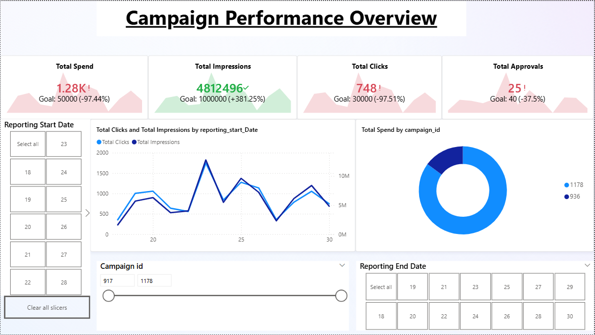
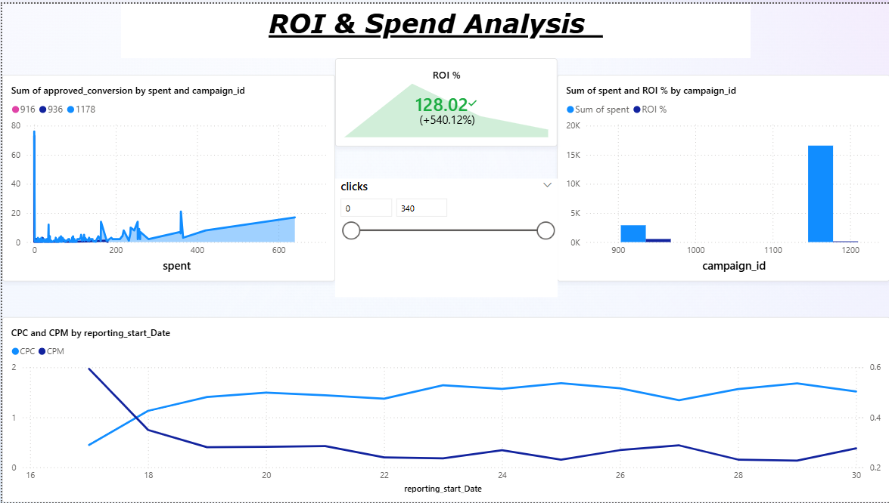

#  FUTURE_DS_02 – Social Media Campaign Analytics

This repository contains my **Task 2 submission** for the **Future Interns Data Science & Analytics Internship**.  
The task focuses on analyzing **Facebook/Instagram ad campaign performance** using **Power BI** and providing insights into engagement, CTR, ROI, and campaign optimization.

---

##  Project Overview
Digital marketing campaigns generate a large volume of performance data.  
The goal of this task was to:
- Analyze ad campaign data (Facebook/Instagram export).
- Track **spend, impressions, clicks, conversions, CTR, ROI, CPC**.
- Build **interactive dashboards in Power BI** for decision-making.
- Provide insights on campaign efficiency and audience engagement.

---

##  Repository Structure

```
FUTURE_DS_02/
│── data.csv                    # Raw campaign dataset
│── FUTURE_DS_02.pbix          # PowerBi for visulization
│── screenshot1.png             # Page 1 - Campaign Overview Dashboard
│── screenshot2.png             # Page 4 - ROI & Spend Analysis Dashboard
│── README.md                   # Documentation
```

---

##  Dashboard Snapshots

### 1️ Campaign Performance Overview  
KPIs (Spend, Impressions, Clicks, Approvals), Trend over Time, Spend by Campaign.  


---

### 2️ ROI & Spend Analysis  
Scatter plot of Spend vs Conversions, ROI % by Campaign, CPC Trend over Time.  


---

##  Key Metrics Used
- **Spend** – Amount spent on ads.  
- **Impressions** – How many times ads were shown.  
- **Clicks** – Engagement measure.  
- **CTR %** – `Clicks ÷ Impressions`.  
- **CPC** – `Spend ÷ Clicks`.  
- **ROI %** – `Approved Conversions ÷ Spend`.  

---

##  Tools & Skills
- **Power BI** → Dashboard design & storytelling.  
- **Python (Pandas, Jupyter Notebook)** → Data preprocessing.  
- **Excel/CSV** → Raw dataset handling.  
- **Data Visualization** → KPIs, trends, and insights.  

---

##  Insights & Recommendations
- Campaigns with **higher CTR** contributed most to ROI.  
- Spend was concentrated in few campaigns → opportunity to rebalance budget.  
- CPC trend indicates efficiency fluctuations across dates.  
- Future campaigns can optimize **target audience (age/gender)** for better ROI.  

---

##  Author
- **Name:** Shreyas V 
- **GitHub:** [shreyas27092004](https://github.com/shreyas27092004)  
- **Repository:** [FUTURE_DS_02](https://github.com/shreyas27092004/FUTURE_DS_02)  

---
*This project was created as part of the Future Interns Data Science & Analytics Internship.*
